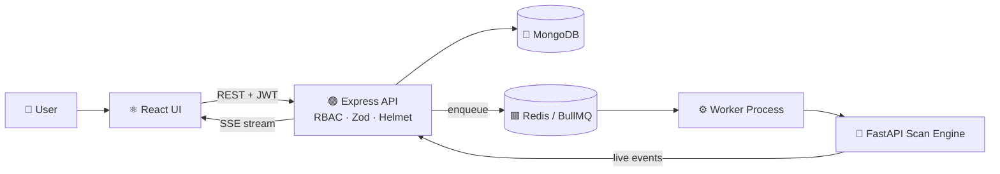

<!-- ============ HEADER ============ -->
<p align="center">
  
</p>

<p align="center">
  <a href="https://github.com/husseinlshaarawy">
    
  </a>
</p>

<p align="center">
  <a href="https://www.linkedin.com/in/hussein-elshaarawy-215bb5131"></a>
  <a href="mailto:elsharawyhussein@gmail.com"></a>
  <a href="https://codeforces.com/profile/husseinlshaarawy"></a>
  
</p>

<p align="center">
  
  
  
  
  
</p>

---

<!-- ============ ABOUT ============ -->
<table>
<tr>
<td width="58%" valign="top">

### 👨‍💻 `whoami`

```cpp
#include <bits/stdc++.h>
using namespace std;

struct Hussein {
    string base      = "Cairo, Egypt 🇪🇬";
    string degree    = "B.Sc. Computer Science @ AAST";
    string role      = "Full-Stack Engineer";
    string sport     = "Competitive Programming (ICPC)";
    string startup   = "NovaSecLabs 🛡️ (seed funded)";
    vector<string> loves = {
        "system design", "real-time apps",
        "LLM integration", "clean APIs",
        "hard problems"
    };
};

int main() {
    Hussein me;
    cout << "Let's build something great 🚀";
}
```

</td>
<td width="42%" valign="top">

### ⚡ Quick Facts

🔭 **Building** an AI health tracker with a voice-powered LLM assistant

🛡️ **Founding** NovaSecLabs, a security startup that won seed funding at Rally Egypt 2025

⚔️ **Competing** in ICPC, went from 95th → **36th** at ECPC

🚗 **Programmed** real vehicle ECUs via OBD at Audi

🌱 **Exploring** distributed systems, cloud & scalable architecture

💬 **Ask me about** MERN, React Native, Redis queues, algorithms

</td>
</tr>
</table>

---

<!-- ============ TECH STACK ============ -->
## 🧰 Tech Arsenal

<p align="center">
  <b>Languages</b><br><br>
  
</p>

<p align="center">
  <b>Frontend & Mobile</b><br><br>
  <br>
  
  
  
  
  
</p>

<p align="center">
  <b>Backend & Databases</b><br><br>
  <br>
  
  
  
  
  
</p>

<p align="center">
  <b>Cloud, DevOps & AI</b><br><br>
  <br>
  
  
  
</p>

---

<!-- ============ PROJECTS ============ -->
## 🚀 Featured Projects

<table>
<tr>
<td width="50%" valign="top">

### 🩺 AI-Powered Health Tracker
<sub>🎓 Graduation Project</sub>

Cross-platform (iOS / Android / Web) health app for patients & doctors, featuring **"Aura"**, an LLM assistant that classifies voice logs and delivers proactive daily insights.

- 🎙️ Self-hosted **Whisper** speech-to-text microservice
- 📊 Daily scoring engine: water, sleep, meds, calories, exercise
- 🔐 JWT + bcrypt auth with role-based access

    

</td>
<td width="50%" valign="top">

### 🛡️ VulnGPT Pro Dashboard
<sub>⚙️ Multi-tenant SaaS</sub>

Security scanning dashboard with **Tenant → Workspace → Membership** RBAC, live scan streaming, and a decoupled job pipeline.

- 🧩 RBAC enforced across **60+ API endpoints**
- 📡 Real-time progress via **Server-Sent Events**
- 🧵 Async workers with **BullMQ + Redis**
- 🔒 OAuth, Zod, Helmet, rate limiting, audit logs, at-rest encryption

    

</td>
</tr>
<tr>
<td width="50%" valign="top">

### 💬 Android Messaging App

Real-time one-to-one chat with Firebase authentication, live cross-device sync, email verification and password recovery, in a clean minimal UI.

  

</td>
<td width="50%" valign="top">

### 🏥 Clinic Management System

Desktop system for patients & appointments, architected with UML and backed by a secure MySQL database.

  

</td>
</tr>
</table>

<details>
<summary><b>🏗️ Peek inside VulnGPT's architecture</b></summary>
<br>



</details>

---

<!-- ============ COMPETITIVE PROGRAMMING ============ -->
## ⚔️ Competitive Programming

<p align="center">
  <a href="https://codeforces.com/profile/husseinlshaarawy">
    
  </a>
</p>

<div align="center">

| 🏟️ Contest | 📍 Rank | 📈 |
|:--|:--:|:--:|
| **ECPC 2025** | 🥇 **36th** / 217 | Top 17% |
| ECPC 2024 | 219th / 414 | Top 53% |
| ECPC 2023 | 95th / 150 | First ICPC season |

</div>

---

<!-- ============ GITHUB STATS ============ -->
## 📊 GitHub Analytics

<p align="center">
  
  
</p>

<p align="center">
  
</p>

<p align="center">
  
</p>

<p align="center">
  
</p>

<!-- ============ SNAKE (needs the snake.yml workflow) ============ -->
<p align="center">
  <picture>
    <source media="(prefers-color-scheme: dark)" srcset="https://raw.githubusercontent.com/husseinlshaarawy/husseinlshaarawy/output/github-snake-dark.svg" />
    <source media="(prefers-color-scheme: light)" srcset="https://raw.githubusercontent.com/husseinlshaarawy/husseinlshaarawy/output/github-snake.svg" />
    
  </picture>
</p>

---

<p align="center">
  
</p>

<p align="center">
  
</p>
